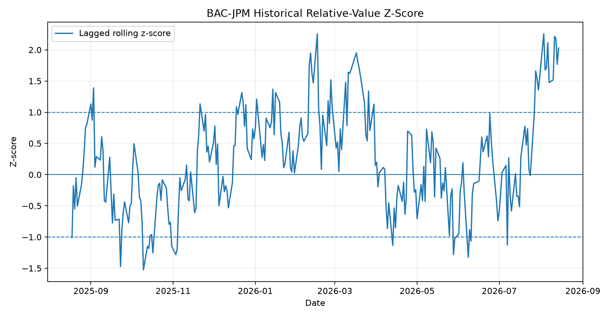
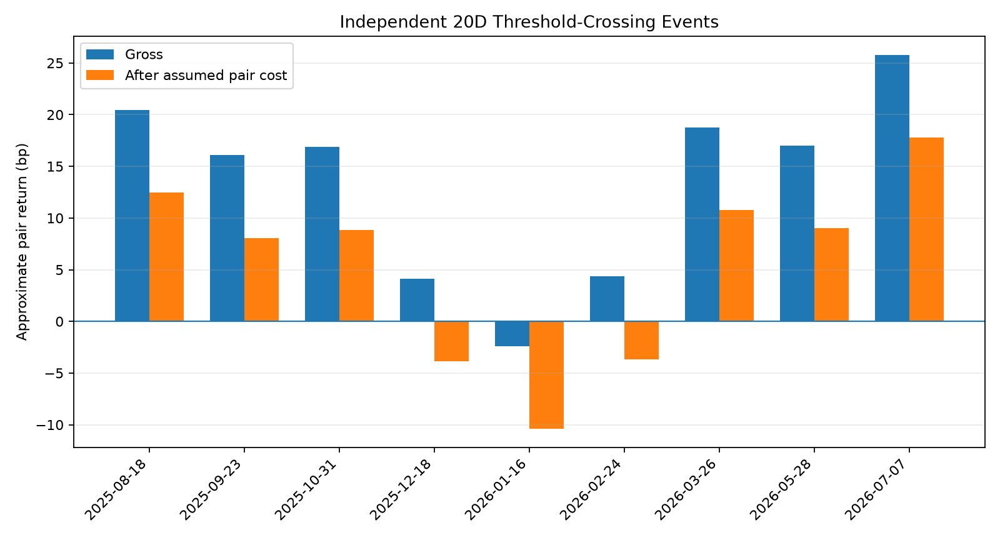

# Institutional Corporate Bond Portfolio Management

An independent personal research project exploring institutional U.S. investment-grade corporate bond portfolio management with Python.

The framework connects:

**Credit Analysis → Relative Value → Risk Decomposition → Expected Return → Portfolio Optimization → Stress Testing → Portfolio Construction → Trading → P&L Attribution → Validation**

The central research question is:

> When does additional corporate-bond spread provide enough compensation for credit, liquidity, concentration, and tail risk?

## Scope

The repository simulates a **$100 million Financials sleeve** within a broader investment-grade corporate bond framework. The initial research universe uses representative bonds from:

- JPMorgan Chase
- Bank of America
- Citigroup
- Wells Fargo

Named issuers are used solely as public-market examples. All bond-level spreads, CDS levels, holdings, liquidity observations, expected returns, and scenario results in `data/demo/` are synthetic and illustrative.

## Research results — synthetic demo

The latest synthetic BAC/JPM case illustrates the full decision process rather than treating a wide spread as an automatic buy signal.

| Latest case metric | Result |
|---|---:|
| BAC representative OAS | 84.43 bp |
| JPM representative OAS | 67.72 bp |
| BAC-JPM market differential | 16.71 bp |
| Lagged historical mean differential | 12.58 bp |
| Historical z-score | +2.03σ |
| CDS/bond RV residual | +8.79 bp |
| Cross-sectional regression residual | +4.57 bp |
| Blended RV signal | **+6.57 bp** |
| Expected 1M return | **61.50 bp** |
| Model action | **Add BAC / Reduce JPM** |



The proposed $10M BAC add / approximately $10M JPM reduction is DV01-matched. In the synthetic stress framework, the trade improves the Normal scenario slightly but increases the Slowdown loss by about 0.13 percentage points and the Crisis loss by about 0.50 percentage points. This is why the framework uses position limits and a portfolio overlay rather than allowing the relative-value signal to determine size by itself.

### Chronological RV validation

The BAC/JPM signal is also tested against subsequent pair-spread changes using a lagged historical benchmark.

| Forward horizon | Signal observations | Avg signed convergence | Convergence hit rate | Avg gross pair return |
|---|---:|---:|---:|---:|
| 5D | 56 | 1.50 bp | 80.4% | 6.87 bp |
| 20D | 47 | 2.73 bp | 87.2% | 12.37 bp |
| 60D | 42 | 3.33 bp | 88.1% | 15.19 bp |

A separate non-overlapping 20-business-day event test produces **9 independent threshold-crossing events**, an **88.9% gross convergence hit rate**, and an average approximate **5.45 bp net pair return** after an explicit 8 bp pair implementation-cost assumption. These results are properties of the synthetic dataset, not a live historical track record.



Detailed research notes:

- [BAC vs JPM relative-value case study](docs/bac_jpm_case_study.md)
- [BAC vs JPM chronological signal validation](docs/bac_jpm_backtest.md)
- [Methodology](docs/methodology.md)
- [Data contract](docs/data_contract.md)

## Research dashboard

A static presentation dashboard is generated at [`docs/index.html`](docs/index.html). It is designed for GitHub Pages and summarizes the latest synthetic research outputs in one page:

- BAC/JPM relative-value signal and decomposition
- Issuer-level OAS, RV, expected return, and action
- Current vs model portfolio allocation
- Portfolio DV01 / CS01 snapshot
- Normal / Slowdown / Crisis stress results
- 5D / 20D / 60D chronological validation
- Independent-event backtest statistics
- Links to the case study, validation notes, methodology, and data contract

Refresh the dashboard together with all research outputs:

```bash
python scripts/build_research_outputs.py
```

Or rebuild only the static dashboard after the other outputs already exist:

```bash
python scripts/build_static_dashboard.py
```

When GitHub Pages is configured to deploy the `docs/` folder on the `main` branch, the dashboard is available at:

`https://kevinli25423-cmd.github.io/corporate-bond-portfolio-management/`

## V2 real-data module

The repository includes a public-data BAC/JPM pair workflow using user-exported FINRA secondary-market trades plus official U.S. Treasury daily par-yield curves. The first real pair uses JPM CUSIP `46647PEU6` and BAC CUSIP `06051GMT3`. Because both are fixed-to-floating callable notes, the public implementation uses **yield to first par call minus interpolated Treasury** and explicitly labels the result a proxy spread rather than OAS.

Setup and methodology: [V2 Step 1 — real BAC/JPM data](docs/real_data_step1.md).

After saving the two FINRA CSV exports under `data/raw/trace/`, run:

```bash
python scripts/build_real_bac_jpm_pair.py
```

Raw FINRA exports and processed real-data CSVs are ignored by Git by default.

## What the project implements

- Security master and point-in-time data architecture
- Fundamental credit scorecard
- Historical pair relative value with lagged rolling z-scores
- CDS and bond-characteristic fair-spread decomposition
- Cross-sectional regression as a confirmation signal
- DV01, CS01, and key-rate-duration analysis
- Issuer concentration and liquidity analytics
- Carry + roll-down + spread-convergence expected return
- Transaction-cost adjustment
- Constrained portfolio optimization
- Normal, slowdown, and crisis stress scenarios
- Portfolio construction overlay after optimization
- Trade sizing and trade blotter
- One-month P&L attribution and thesis validation
- Chronological pair-RV validation and non-overlapping event backtest
- Reproducible research charts and Markdown case-study outputs
- Optional Streamlit dashboard

## Analytical philosophy

A wide spread is not automatically a buy signal. The workflow asks whether the spread difference is explainable and whether the remaining compensation is attractive after risk and trading costs.

```text
Observed Market Spread
        ↓
Historical Relationship
        ↓
Market-Implied Credit
        ↓
Fundamental Credit
        ↓
Bond / Liquidity Characteristics
        ↓
Relative-Value Residual
        ↓
Expected Convergence
        ↓
Expected Return
        ↓
Risk Budget
        ↓
Portfolio Allocation
        ↓
Stress Testing
        ↓
Attribution
        ↓
Out-of-Sample Validation
```

Portfolio optimization is treated as a decision-support layer, not as an automatic final allocation rule.

## Quick start

Create and activate an environment, then install the core research dependencies:

```bash
python -m venv .venv
source .venv/bin/activate
pip install -r requirements.txt
```

Run the portfolio pipeline:

```bash
python scripts/generate_demo_data.py
python scripts/run_pipeline.py
```

Build the BAC/JPM case study and RV validation outputs:

```bash
python scripts/build_bac_jpm_case_study.py
python scripts/run_rv_backtest.py
```

Or refresh the full pipeline, case study, and backtest together:

```bash
python scripts/build_research_outputs.py
```

Run tests:

```bash
python -m pytest tests -v
```

Optional dashboard dependencies:

```bash
pip install -r requirements-dashboard.txt
```

Launch the dashboard:

```bash
streamlit run app.py
```

## Repository structure

```text
.
├── app.py
├── config/
│   └── project_config.json
├── data/
│   ├── demo/
│   └── output/
├── docs/
│   ├── index.html                 # static GitHub Pages dashboard
│   ├── bac_jpm_case_study.md
│   ├── bac_jpm_backtest.md
│   ├── data_contract.md
│   ├── methodology.md
│   ├── figures/
│   └── results/
├── notebooks/
│   └── 01_end_to_end_research.ipynb
├── scripts/
│   ├── build_bac_jpm_case_study.py
│   ├── build_research_outputs.py
│   ├── build_static_dashboard.py
│   ├── generate_demo_data.py
│   ├── run_pipeline.py
│   └── run_rv_backtest.py
├── src/
│   └── corporate_bond_pm/
│       ├── attribution.py
│       ├── data.py
│       ├── expected_return.py
│       ├── fundamentals.py
│       ├── optimizer.py
│       ├── relative_value.py
│       ├── risk.py
│       ├── stress.py
│       ├── trading.py
│       └── validation.py
└── tests/
    ├── test_expected_return.py
    ├── test_risk.py
    ├── test_rv.py
    └── test_validation.py
```

## Core formulas

Historical pair spread:

```text
D_t = OAS_A,t - OAS_B,t
Z_t = (D_t - lagged rolling mean) / lagged rolling standard deviation
```

Fair differential:

```text
D_fair = D_credit + D_duration + D_liquidity + D_structure
RV = D_market - D_fair
```

Spread-price approximation:

```text
ΔP / P ≈ -SpreadDuration × ΔSpread
```

Expected return:

```text
E[R] = Carry + RollDown - SpreadDuration × E[ΔSpread] + RatesView - TransactionCost
```

Portfolio objective:

```text
max_w  w'α - λ(w'Σw) - γTC(w)
```

subject to fully invested, issuer concentration, cash, and duration constraints.

## Data design

The included demo dataset is deterministic and synthetic so the full workflow can be reproduced without proprietary data. The same schemas can be populated with appropriately licensed market, transaction, portfolio, and credit data.

The model intentionally keeps market data, fundamentals, liquidity observations, and security terms in separate tables so that point-in-time joins and data lineage remain explicit.

## Relative-value interpretation

For two comparable bonds:

```text
D_market = OAS_A - OAS_B
D_credit = CDS_A - CDS_B
D_fair = D_credit + D_bond + D_liquidity
RV = D_market - D_fair
```

A positive `RV` means Bond A trades wider than the spread difference explained by the selected factors. It indicates potential relative cheapness, not a guaranteed mispricing.

The project combines three signals:

1. Historical relative spread
2. CDS / bond-characteristic fair differential
3. Cross-sectional regression residual

## Risk framework

Approximate dollar sensitivities:

```text
DV01 ≈ ModifiedDuration × MarketValue × 0.0001
CS01 ≈ SpreadDuration × MarketValue × 0.0001
```

Rates exposure is also decomposed across 2Y, 3Y, 5Y, 7Y, and 10Y key-rate nodes.

## Validation design

The validation module follows chronological rather than random train/test logic. The lagged z-score is formed using only information available at the signal date; future 5D, 20D, and 60D pair changes are attached afterward for evaluation.

Two views are reported:

1. **Daily signal diagnostics** — all days where the absolute z-score exceeds a threshold.
2. **Independent event backtest** — only threshold crossings, with overlapping holding periods blocked.

This distinction prevents a sequence of consecutive signal days from being presented as independent trades.

## Stress testing

The project includes three illustrative regimes:

- Normal
- Slowdown
- Crisis

Each scenario combines Treasury shocks, Financials spread shocks, issuer sensitivity multipliers, and liquidity costs. The purpose is to compare expected compensation with downside exposure rather than to forecast the exact timing of market stress.

## P&L attribution

The attribution layer separates:

```text
Total P&L
= Rates
+ Market Spread
+ Issuer / Relative Value
+ Carry
+ Roll-Down
```

This helps distinguish whether a position worked because the relative-value thesis converged or because broad market factors moved favorably.

## Disclaimer

This repository is an independent personal research and educational project. Synthetic examples are not live market quotations, investment advice, proprietary data, or actual portfolio holdings.
