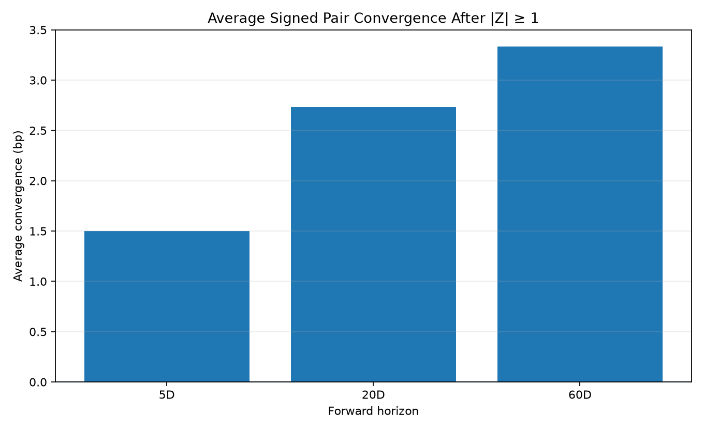
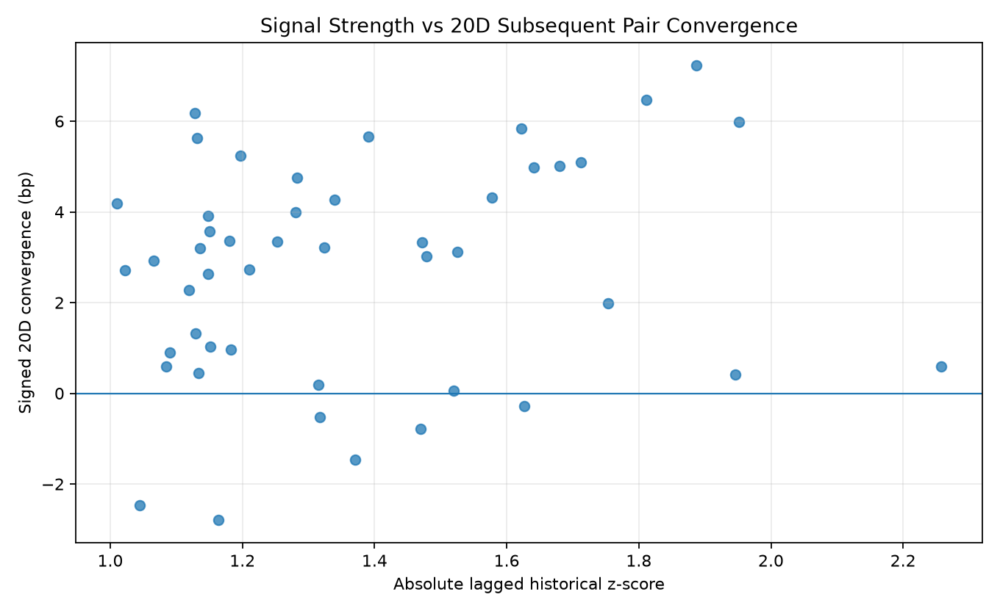

# BAC vs JPM Relative-Value Signal Validation

> **Synthetic research backtest.** The results below use the deterministic demo data included in this repository. They demonstrate a chronological validation design; they are not evidence about live BAC or JPM bonds and should not be interpreted as an investable historical track record.

## Objective

Test whether historical BAC-JPM relative-value dislocations tend to mean-revert after the signal is formed.

The signal uses only information available at time `t`:

```text
D_t = OAS_BAC,t - OAS_JPM,t
Z_t = (D_t - lagged rolling mean) / lagged rolling standard deviation
```

The rolling mean and standard deviation are lagged by one day. Future pair changes are added only after the signal has been computed, so the validation does not use future information to form `Z_t`.

## 1. Daily signal validation

Signal condition:

```text
|Z_t| >= 1.0
```

A positive signed convergence means the pair subsequently moved in the direction predicted by mean reversion. Consecutive signal days can overlap, so these observations are useful for signal diagnostics but are **not independent trades**.

| Horizon | Signal-day observations | Avg signed convergence | Convergence hit rate | Avg gross pair return | Avg clipped realized q |
|---|---:|---:|---:|---:|---:|
| 5D | 56 | 1.50 bp | 80.4% | 6.87 bp | 0.48 |
| 20D | 47 | 2.73 bp | 87.2% | 12.37 bp | 0.67 |
| 60D | 42 | 3.33 bp | 88.1% | 15.19 bp | 0.78 |

For the 20-business-day horizon, the synthetic sample shows an average signed convergence of **2.73 bp** with a **87.2%** convergence hit rate. The average clipped realized convergence ratio is **0.67**.





## 2. Independent event backtest

To reduce overlap, a trade event starts only when `|Z|` crosses the threshold from below. No new event is permitted until the 20-business-day holding period has elapsed.

The approximate pair return uses matched spread duration:

```text
Gross pair return (bp) ≈ matched spread duration × signed pair convergence (bp)
```

The net result subtracts an explicit **8.0 bp all-in pair implementation-cost assumption**. This is a research assumption, not an observed historical execution cost.

| Entry date | Entry Z | Direction | 20D convergence | Gross return | Net return |
|---|---:|---|---:|---:|---:|
| 2025-08-18 | -1.01 | Short BAC / Long JPM | 4.18 bp | 20.48 bp | 12.48 bp |
| 2025-09-23 | -1.47 | Short BAC / Long JPM | 3.34 bp | 16.07 bp | 8.07 bp |
| 2025-10-31 | -1.15 | Short BAC / Long JPM | 3.56 bp | 16.86 bp | 8.86 bp |
| 2025-12-18 | 1.09 | Long BAC / Short JPM | 0.89 bp | 4.13 bp | -3.87 bp |
| 2026-01-16 | 1.32 | Long BAC / Short JPM | -0.52 bp | -2.39 bp | -10.39 bp |
| 2026-02-24 | 1.18 | Long BAC / Short JPM | 0.97 bp | 4.34 bp | -3.66 bp |
| 2026-03-26 | 1.34 | Long BAC / Short JPM | 4.26 bp | 18.78 bp | 10.78 bp |
| 2026-05-28 | -1.28 | Short BAC / Long JPM | 3.99 bp | 17.03 bp | 9.03 bp |
| 2026-07-07 | -1.13 | Short BAC / Long JPM | 6.18 bp | 25.80 bp | 17.80 bp |

### Independent-event summary

| Metric | Result |
|---|---:|
| Number of events | 9 |
| Average signed convergence | 2.98 bp |
| Gross convergence hit rate | 88.9% |
| Average gross pair return | 13.45 bp |
| Average net pair return | 5.45 bp |
| Net-positive event rate | 66.7% |
| Avg clipped realized convergence ratio | 0.72 |


## 3. How this informs the expected-return model

The portfolio code contains a convergence parameter `q` in:

```text
E[ΔSpread] = -q × RV
```

The backtest provides an empirical way to challenge that assumption. In this synthetic sample, the 20D daily-signal average clipped realized convergence ratio is **0.67**, while the independent-event average clipped ratio is **0.72**.

This does **not** prove a stable real-world value for `q`. It demonstrates the correct validation workflow: estimate the parameter from chronologically subsequent outcomes, compare it with the model assumption, and re-estimate as the sample grows.

## 4. Limitations

- The dataset is synthetic and deliberately contains structured mean reversion.
- Consecutive daily signal observations are serially correlated.
- The independent-event sample is small.
- Spread-duration approximation ignores convexity and detailed carry/financing of a true long-short implementation.
- Transaction cost is an explicit assumption rather than historical executable quotes.
- A production study would repeat the analysis across many matched issuer/bond pairs and use walk-forward model estimation.

The purpose of this module is therefore **methodological validation**, not a claim of historical alpha in live bonds.
