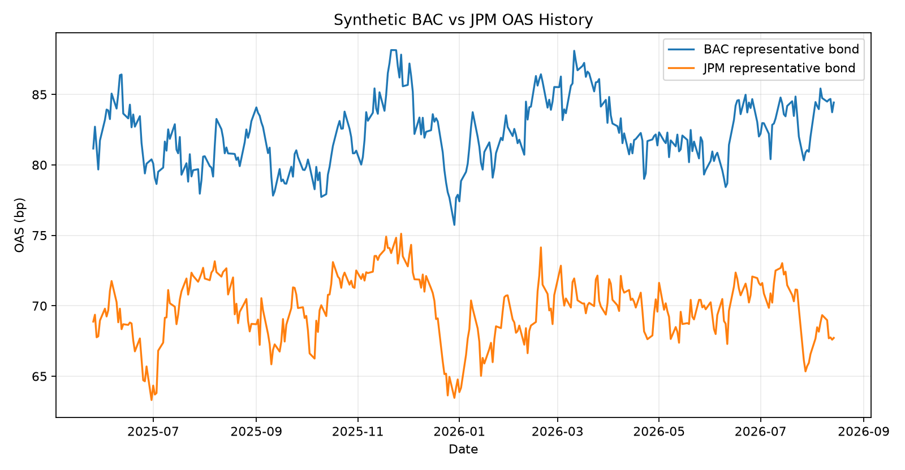
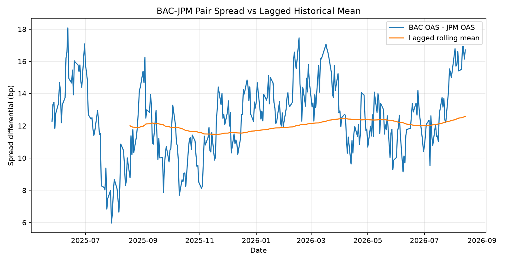
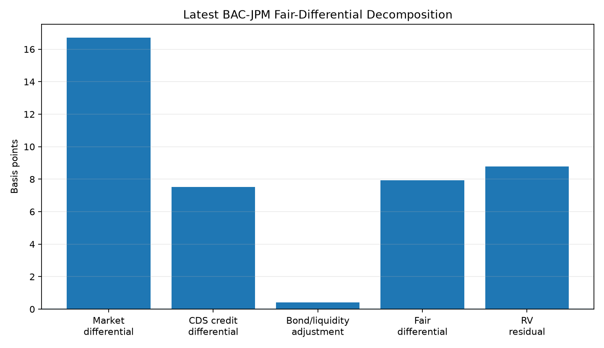
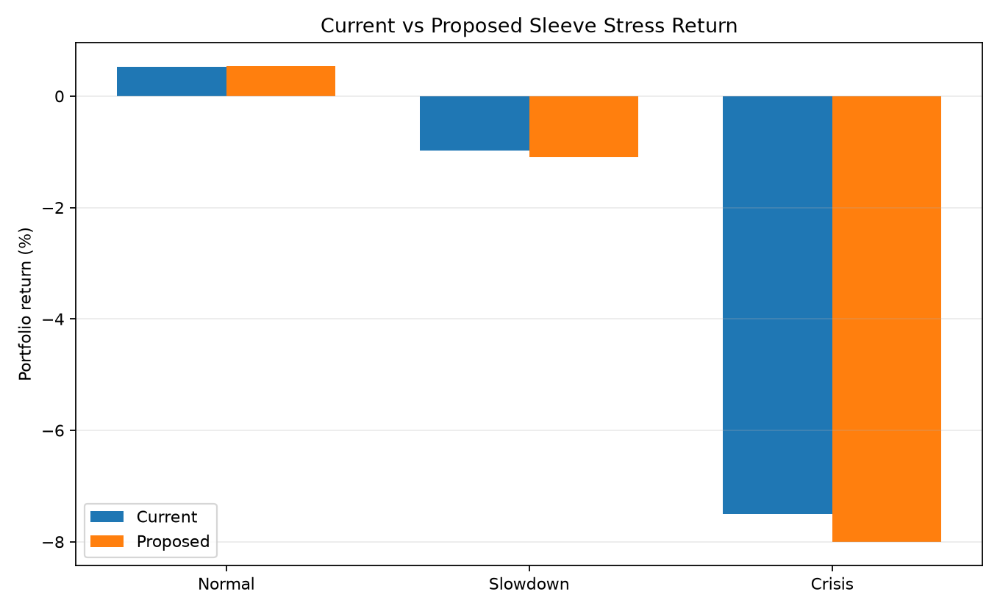

# BAC vs JPM Relative-Value Case Study

> **Synthetic research example.** All bond-level OAS, CDS, liquidity, portfolio weights, expected returns, and stress results in this case study are generated from the repository's deterministic demo dataset. They are not live market quotations or investment recommendations.

## Research question

Does the additional spread on the representative Bank of America bond provide enough compensation relative to a closely matched JPMorgan bond after accounting for market-implied credit, bond/liquidity characteristics, historical relative value, expected convergence, risk, and stress?

**As of:** 2026-08-14  
**Representative securities:** `BAC_3` vs `JPM_3`

## 1. Current market relationship

| Metric | BAC | JPM | BAC - JPM |
|---|---:|---:|---:|
| OAS | 84.43 bp | 67.72 bp | 16.71 bp |
| 5Y CDS | 58.84 bp | 51.33 bp | 7.51 bp |
| Spread duration | 4.09 | 4.09 | 0.00 |
| Liquidity score | 0.812 | 0.864 | -0.052 |
| Fundamental score | 0.00 | 1.42 | — |
| Credit view | Strong | Very Strong | — |



## 2. Historical relative value

The pair spread is defined as:

```text
D_t = OAS_BAC,t - OAS_JPM,t
```

The historical benchmark uses a lagged rolling mean and standard deviation so the current observation does not enter its own benchmark.

| Metric | Latest value |
|---|---:|
| BAC-JPM pair spread | 16.71 bp |
| Lagged rolling mean | 12.58 bp |
| Deviation from mean | 4.13 bp |
| Historical z-score | 2.03σ |




## 3. Fair differential and residual

The cash-bond differential is decomposed as:

```text
D_fair = CDS differential + duration adjustment + liquidity adjustment + structure adjustment
RV = D_market - D_fair
```

| Component | Value |
|---|---:|
| Observed market differential | 16.71 bp |
| CDS credit differential | 7.51 bp |
| Duration adjustment | 0.00 bp |
| Liquidity adjustment | 0.41 bp |
| Fair differential | 7.92 bp |
| CDS/bond RV residual | **8.79 bp** |
| Cross-sectional regression residual | 4.57 bp |
| Historical deviation component | 4.13 bp |
| **Blended RV signal** | **6.57 bp** |

The blended signal uses the research weights in the pipeline: 50% CDS/bond residual, 25% historical deviation, and 25% cross-sectional regression residual.



## 4. Expected return economics

Using the configured convergence assumption of 75%:

| Component | Value |
|---|---:|
| Expected spread move | -4.93 bp |
| Spread-convergence return | 20.14 bp |
| 1M carry | 41.35 bp |
| 1M roll-down | 4.00 bp |
| Transaction cost | -4.00 bp |
| **Expected 1M return** | **61.50 bp** |

The convergence assumption is a forecast parameter rather than a fact. The separate backtest module tests whether historical synthetic signals subsequently converged and reports realized convergence ratios.

## 5. Trade sizing and risk

Illustrative trade:

```text
BUY $10.0M BAC
REDUCE approximately $10.00M JPM
```

The JPM reduction is sized from DV01 so the rates exposure of the pair is approximately neutral.

| Risk measure | BAC leg | JPM hedge leg |
|---|---:|---:|
| DV01 | $4,304/bp | $4,304/bp |
| CS01 | $4,089/bp | $4,089/bp |

The trade intentionally shifts issuer spread exposure toward BAC while keeping the Treasury-duration effect approximately matched.

## 6. Stress overlay

| Scenario | Current sleeve | Proposed sleeve | Change |
|---|---:|---:|---:|
| Normal | 0.53% | 0.54% | +0.01% |
| Slowdown | -0.98% | -1.10% | -0.13% |
| Crisis | -7.50% | -8.00% | -0.50% |



## 7. Research conclusion

**Model action: Add BAC / Reduce JPM.**

The synthetic example shows BAC trading materially wider than JPM relative to the lagged historical relationship. CDS, bond characteristics, and liquidity explain part—but not all—of the observed differential. The blended relative-value signal remains positive, and the expected-return calculation compensates for transaction cost.

The position is therefore implemented as a **moderate BAC overweight versus JPM rather than an unconstrained allocation**. The trade is DV01-matched, issuer CS01 is monitored explicitly, and the stress comparison shows the incremental downside cost of shifting toward the higher-spread issuer.

The objective is not to label BAC as universally "cheap." It is to show a reproducible process for asking whether the incremental spread is sufficient compensation for the incremental credit, liquidity, concentration, and tail risk in the synthetic research environment.
