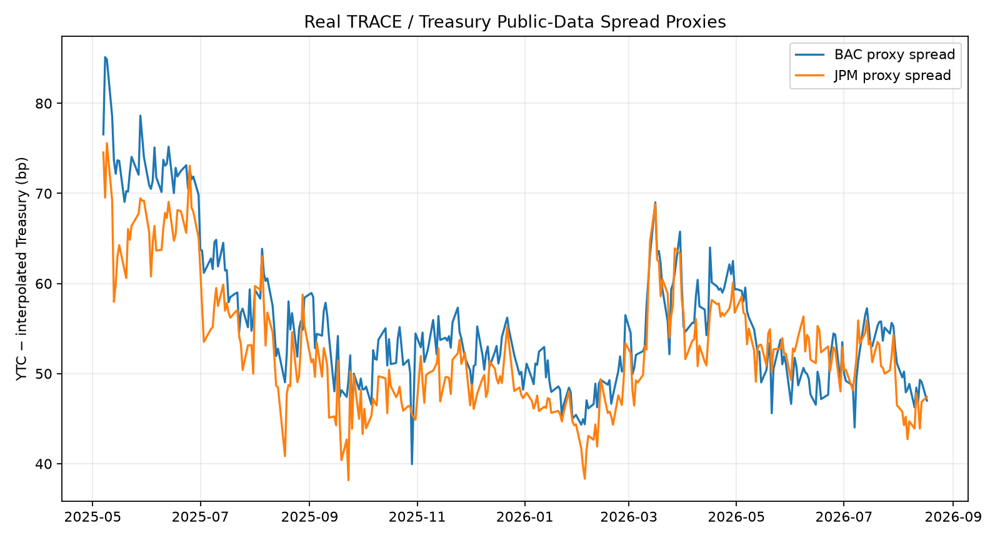
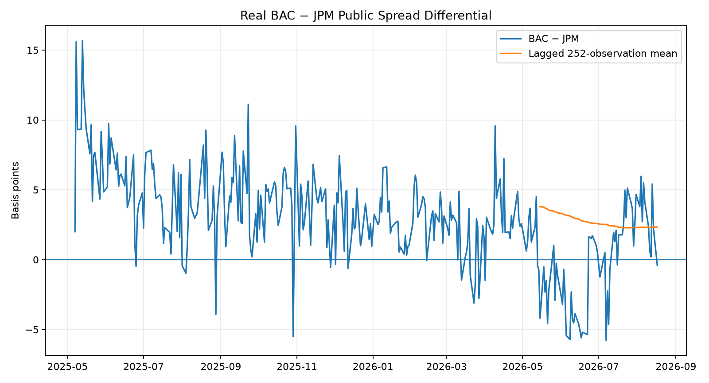
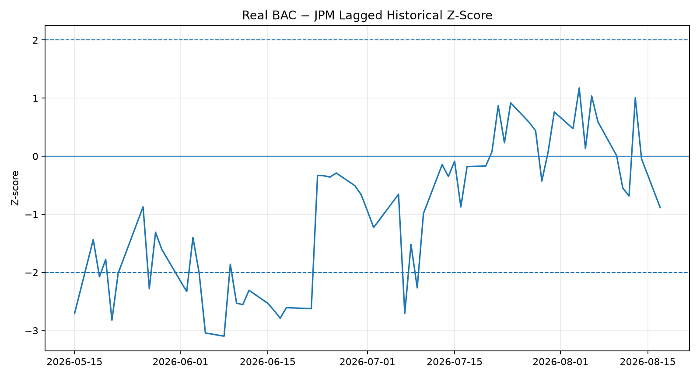

# V2 Step 1 — Real BAC/JPM Public-Data Pair

This module replaces the synthetic pair-spread input with actual secondary-market transaction prices exported from FINRA's public fixed-income interface and official U.S. Treasury daily par-yield data.

## Latest result

Latest fully formed signal date: **2026-08-17**. BAC proxy spread: **47.00 bp**; JPM proxy spread: **47.40 bp**; pair differential: **-0.40 bp**; lagged z-score: **-0.89σ**.

## Chronological validation

| Horizon | Signal observations (`|Z|>=1`) | Avg signed convergence | Hit rate |
|---|---:|---:|---:|
| 5 observations | 30 | 1.55 bp | 63.3% |
| 20 observations | 28 | 3.23 bp | 71.4% |
| 60 observations | 4 | 3.99 bp | 100.0% |

## Public spread definition

`proxy spread = yield to first par call − Treasury yield interpolated to the first par-call date`.

This is deliberately not labeled OAS.
