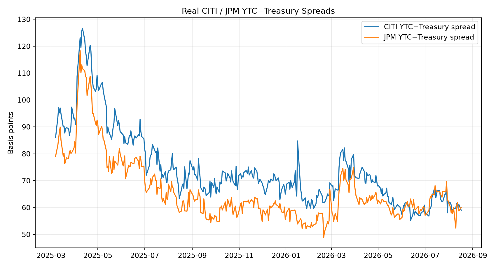
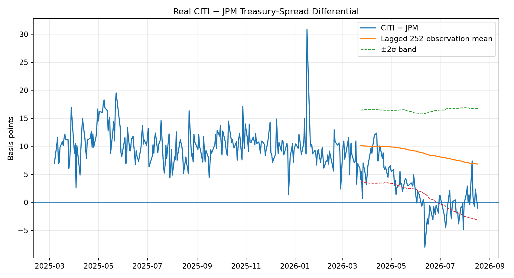
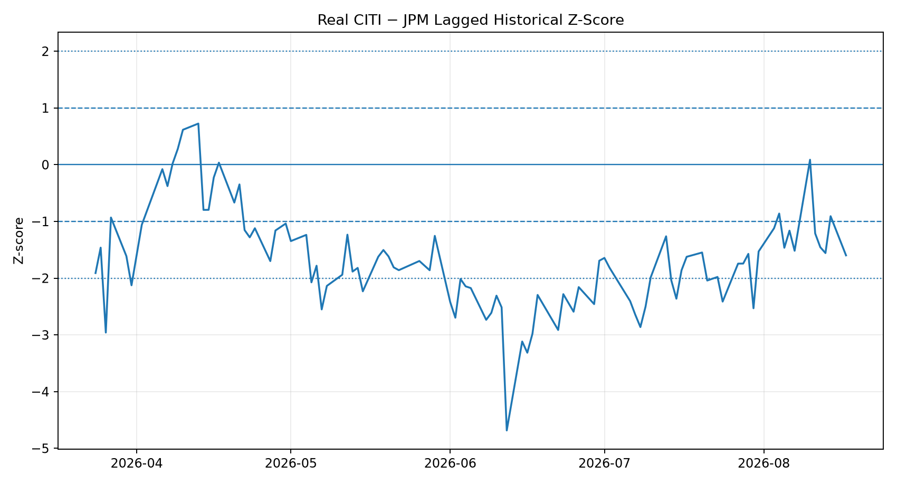

# V2 — Real CITI/JPM Relative-Value Pair

This module uses locally stored FINRA public fixed-income observations for CITI **172967ME8** and JPM **46647PBE5**, combined with official U.S. Treasury daily par yields.

## Latest result

Latest fully formed signal date: **2026-08-17**. CITI YTC−Treasury spread: **58.97 bp**; JPM YTC−Treasury spread: **60.04 bp**; CITI−JPM differential: **-1.07 bp**; lagged z-score: **-1.60σ**; raw signal: **Watch / Moderate RV**; mean-reversion direction: **Short CITI / Long JPM**. Historical validation: **Not supported**. PM decision: **No trade**.

**Validation gate:** 20-observation signal-day average gross return is -3.63 bp with a 38.1% convergence hit rate; mean reversion is not supported.

## Signal-day chronological validation

Positive signed convergence means the future pair move was in the direction implied by the contemporaneous mean-reversion signal. These rows are signal observations and can overlap.

| Horizon | Signal obs (`|Z|>=1`) | Avg convergence | Hit rate | Avg duration-scaled gross return |
|---|---:|---:|---:|---:|
| 5 obs | 76 | 0.14 bp | 43.4% | 0.39 bp |
| 20 obs | 63 | -1.23 bp | 38.1% | -3.63 bp |
| 60 obs | 23 | -4.42 bp | 4.3% | -13.15 bp |

## Independent event backtest

An event begins only when `|Z|` crosses the threshold from below, and no new event is admitted until the holding horizon has elapsed.

| Horizon | Events | Gross hit rate | Avg gross return | Avg net return | Net-positive rate |
|---|---:|---:|---:|---:|---:|
| 5 obs | 3 | 33.3% | -0.78 bp | -8.78 bp | 0.0% |
| 20 obs | 1 | 100.0% | 5.26 bp | -2.74 bp | 0.0% |
| 60 obs | 1 | 0.0% | -18.98 bp | -26.98 bp | 0.0% |

Transaction-cost assumption: **8.0 bp of pair return** per completed event.

## Spread definition

`YTC−Treasury spread = yield to first par call − Treasury par yield interpolated to the first par-call date`.

This is a transparent market spread measure for the public-data implementation. It is **not OAS** because the embedded call option is not separately valued with an option model.

## Decision framework

- The z-score creates a **raw statistical signal**, not an automatic trade.
- Positive `CITI − JPM` z-score implies a mean-reversion direction of **Long CITI / Short JPM**; negative z-score implies **Short CITI / Long JPM**.
- Historical signal-day and independent-event results are then used as a validation gate.
- A signal can therefore be statistically unusual while the final PM decision remains **No trade**.
